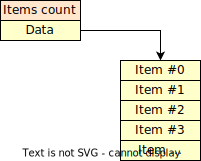
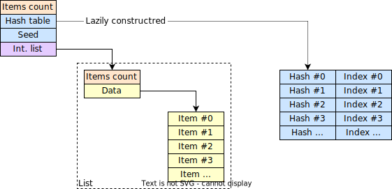
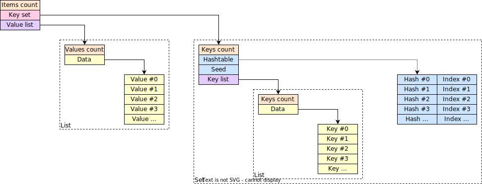
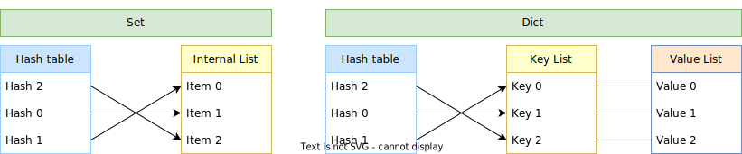

# Podrobnosti o typech kontejnerů

## Seznam

*seznam* představuje konečný počet uspořádaných položek, kde se stejná položka může objevit více než jednou.

## Množina

*množina* je složení *vnitřního seznamu* a hash tabulky.

## Slovník

*slovník* (také známý jako dictionary) je složení množiny (sama o sobě hash tabulka a seznam) klíčů (nazývaných *Množina klíčů* s *Seznamem klíčů*) a seznamu hodnot (nazývaných *Seznam hodnot*).

## Hash tabulka

Typy *Množina* a *Slovník* používají [hash tabulku](https://en.wikipedia.org/wiki/Hash_table).

*hash tabulka* je navržena tak, aby mapovala 64bitový hash klíče přímo na index položky.
Strategie [dokonalého hashe](https://en.wikipedia.org/wiki/Perfect_hash_function) je aplikována, takže pro konstrukci hash tabulky není implementováno žádné řešení kolizí.
Pokud algoritmus pro konstrukci hash tabulky detekuje kolizi, algoritmus se restartuje s jinou *hodnotou semene*.
Tento přístup využívá relativně nízkou míru kolizí xxhash64.

Hash tabulka může být (lenivě) generována pouze tehdy, když je potřeba (např. pro výrazy `!IN` a `!GET`).
To platí pro objekty vytvářené dynamicky během běhu programu.
Statické množiny a slovníky poskytují připravenou hash tabulku.

Hash tabulka se vyhledává pomocí [binárního vyhledávání](https://en.wikipedia.org/wiki/Binary_search_algorithm).

Použité hashovací funkce jsou:

 * [XXH3 64bit](https://cyan4973.github.io/xxHash/) s hodnotou semene pro `str`
 * `xor` s hodnotou semene pro `si64`, `si32`, `si16`, `si8`, `ui64`, `ui32`, `si16`, `ui8`