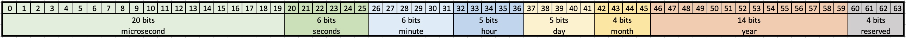
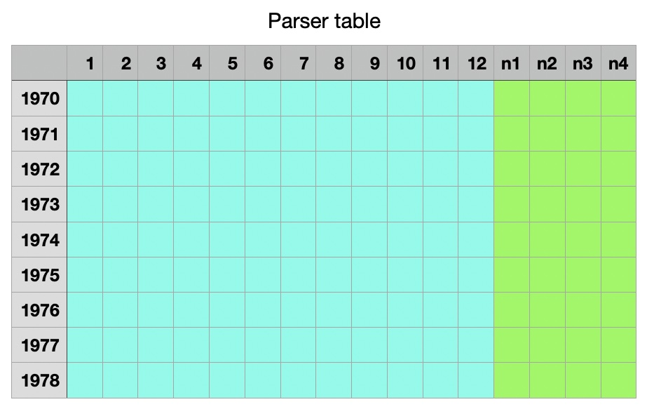

# SP-Lang datum/čas 

Typ `datetime` je hodnota, která představuje datum a čas v UTC, pomocí rozložené časové struktury.  
Rozložený čas znamená, že rok, měsíc, den, hodina, minuta, sekunda a mikrosekunda jsou uloženy v dedikovaných polích; odlišně od například UNIX timestampu.

* Časové pásmo: [UTC](https://en.wikipedia.org/wiki/Coordinated_Universal_Time)
* Rozlišení: mikrosekundy (šest desetinných míst)

!!! tip "Užitečné nástroje"

	* [UNIX Timestamp](https://www.unixtimestamp.com)
	* [Převodník UTC na místní čas a naopak](https://www.worldtimebuddy.com)


## Bitové rozložení

Datetime je uložen v 64bitovém unsigned integer (`ui64`); little-endian formát, Intel/AMD 64bit nativní.



<table>
<thead>
	<tr>
		<th>Pozice</th>
		<th>Komponenta</th>
		<th>Bitů</th>
		<th>Maska</th>
		<th>Typ*</th>
		<th>Rozsah</th>
		<th>Poznámka</th>
	</tr>
</thead>
<tbody>
	<tr style="border-top: 2px solid gray; background-color: #d0cecf;">
		<td>58-63</td>
		<td></td>
		<td>4</td>
		<td></td>
		<td></td>
		<td>0…15</td>
		<td>OK (0)/Chyba (8)/Rezervováno</td>
	</tr>
	<tr style="border-top: 1px solid gray; background-color: #f1ccb1;">
		<td>46-57</td>
		<td>rok</td>
		<td>14</td>
		<td></td>
		<td><code>si16</code></td>
		<td>-8190…8191</td>
		<td></td>
	</tr>
	<tr style="border-top: 1px solid gray; background-color: #fbe6a3;">
		<td>42-45</td>
		<td>měsíc</td>
		<td>4</td>
		<td>0x0F</td>
		<td><code>ui8</code></td>
		<td>1…12</td>
		<td>Indexováno od 1</td>
	</tr>
	<tr style="border-top: 1px solid gray; background-color: #fcf2cf;">
		<td>37-41</td>
		<td>den</td>
		<td>5</td>
		<td>0x1F</td>
		<td><code>ui8</code></td>
		<td>1…31</td>
		<td>Indexováno od 1</td>
	</tr>
	<tr style="border-top: 1px solid gray; background-color: #c1d5ed;">
		<td>32-36</td>
		<td>hodina</td>
		<td>5</td>
		<td>0x1F</td>
		<td><code>ui8</code></td>
		<td>0…24</td>
		<td></td>
	</tr>
	<tr style="border-top: 1px solid gray; background-color: #dfebf7;">
		<td>26-31</td>
		<td>minuta</td>
		<td>6</td>
		<td>0x3F</td>
		<td><code>ui8</code></td>
		<td>0…59</td>
		<td></td>
	</tr>
	<tr style="border-top: 1px solid gray; background-color: #cbe0b9;">
		<td>20-25</td>
		<td>sekunda</td>
		<td>6</td>
		<td>0x3F</td>
		<td><code>ui8</code></td>
		<td>0…60</td>
		<td>60 je pro přestupnou sekundu</td>
	</tr>
	<tr style="border-top: 1px solid gray; border-bottom: 1px solid gray; background-color: #e3eedd;">
		<td>0-19</td>
		<td>mikrosekunda</td>
		<td>20</td>
		<td></td>
		<td><code>ui32</code></td>
		<td>0…1000000</td>
		<td></td>
	</tr>
</tbody>
</table>


!!! note

	*) Typ je doporučený/minimální byte-aligned typ pro příslušnou komponentu.


## Detaily časového pásma

Informace o časovém pásmu pochází z [pytz](http://pytz.sourceforge.net) respektive z [IANA databáze časových pásem](https://www.iana.org/time-zones).

!!! note

	Databáze časových pásem má přesnost až na minutu, což znamená, že sekundy a mikrosekundy zůstávají nedotčeny při převodu z/do UTC.

Data časového pásma jsou reprezentována strukturou adresářů v souborovém systému, která se obvykle nachází na `/usr/share/splang` nebo na místě určeném proměnnou prostředí `SPLANG_SHARE_DIR`.  
Skutečná data časového pásma jsou uložena v podložce `tzinfo`.  
Data časového pásma jsou generována skriptem `generate_datetime_timezones.py` během instalace SPLang.

!!! example "Příklad složky `tzinfo`"

		```
		.
		└── tzinfo
		  ├── Europe
		    │  ├── Amsterdam.sptl
		    │  ├── Amsterdam.sptb
		    │  ├── Andorra.sptl
		    │  ├── Andorra.sptb
		```

`.sptl` a `.sptb` soubory obsahují rychlostně optimalizované binární tabulky, které podporují rychlé vyhledávání pro převody místního času <-> UTC.  
`.sptl` je pro little-endian CPU architektury (x86 a x86-64), `.sptb` je pro big-endian architektury.

Soubor je [memory-mapped](https://en.wikipedia.org/wiki/Memory-mapped_file) do paměti procesu SP-Lang, zarovnaný na 64byte hranici, takže může být přímo použit jako vyhledávání.

### Společné struktury

  * `ym`: Rok & měsíc, `ym = (rok << 4) + měsíc`
  * `dhm`: Den, hodina & minuta, `dhm = (den << 11) + (hodina << 6) + minuta`

Obě struktury jsou bitové části skalární hodnoty `datetime` a mohou být extrahovány z `datetime` pomocí `AND` a `SHR`.**

### Hlavička souboru časového pásma

Délka hlavičky je 64 bytů.  
Nespecifikované byty jsou nastaveny na `0` a rezervovány pro budoucí použití.

  * Pozice `00...03`: `SPt` / magický identifikátor
  * Pozice `04`: `<` pro little-endian CPU architekturu, `>` pro big-endian
  * Pozice `05`: Verze (aktuálně `1` ASCII znak)
  * Pozice `08...09`: Minimální rok/měsíc (`min_ym`) v tomto souboru, měsíc MUSÍ BÝT 1
  * Pozice `10...11`: Maximální rok/měsíc (`min_ym`) v tomto souboru
  * Pozice `12...15`: Pozice "parser tabulky" v souboru, vynásobené 64, typicky `1`, protože parser tabulka je uložena přímo za hlavičkou


### Parser tabulka časového pásma

_Parser tabulka_ je vyhledávací tabulka používaná pro převod z místního data/času na UTC.



Tabulka je organizována do řádků/roků a sloupců/měsíců.  
Buňka má šířku 4 byty (32bitů), řádek má tedy délku 64 bytů.

Prvních 12 buněk jsou "primární parser buňky" (světle modrá barva), číslo odráží číslo měsíce (1...12).  
Zbývající 4 buňky jsou "parser next buňky", číslo `nX` je index.

### Primární parser buňka

Pozice buňky pro dané datum/čas se vypočítává jako `pos = (ym - min_ym) << 5`, což znamená, že rok a měsíc jsou použity pro lokalizaci buňky, minus minimální hodnotu roku a měsíce pro tabulku.

Struktura buňky:

  * `16` bitů: rozsah, 16bitů, `dhm`
  * `3` bitů: `next`
  * `7` bitů: hodinový offset od UTC
  * `6` bitů: minutový offset od UTC

`dhm` označuje den, hodinu a minutu v roce/měsíci, kdy je pozorována změna času (např. začátek/konec letního času).  
Pro typický měsíc - kde není pozorována žádná změna času - hodnota `dhm` představuje maximum v daném měsíci.

Pokud je `dhm` pro vstupní datum/čas matematicky nižší než `dhm` z primární buňky, pak jsou informace o hodině a minutě použity k úpravě data/času z místního na UTC.

Pokud je `dhm` větší, pak `next` obsahuje číslo "parser next buňky"; přítomné na konci příslušného řádku parser tabulky.


### Parser next buňka

"Parser next buňka" obsahuje "pokračování" informací pro měsíc, kde je pozorována změna času.  
"Pokračování" znamená offset od UTC, který nastává, když místní čas překročí hranici změny času.

Struktura buňky:

  * `16` bitů: rozsah, 16bitů, `dhm`
  * `3` bitů: nepoužité, nastaveno na 0
  * `7` bitů: hodinový offset od UTC
  * `6` bitů: minutový offset od UTC


`dhm` označuje den, hodinu a minutu v roce/měsíci, kdy je pozorována DALŠÍ změna času (např. začátek/konec letního času).  
Protože v současnosti podporujeme pouze jednu změnu času v měsíci, je toto pole nastaveno na maximální `dhm` pro daný měsíc.

Informace o hodině a minutě jsou použity k úpravě data/času z místního na UTC.

!!! note

	V současnosti je podporována pouze jedna změna času za měsíc, což se zdá být plně dostačující pro všechny informace v databázi časových pásem IANA.

Prázdné/nepoužité next buňky jsou nulovány.


## Chyby

Pokud je bit 63 `datetime` nastaven, pak hodnota data/času představuje chybu.  
Pravděpodobně výraz, který tuto hodnotu vytvořil, selhal nějakým způsobem.

Chybový kód je uložen v dolních 32 bitech.


## Smíšené typy

Protože `datetime` je 64bitový unsigned integer, může se stát - ačkoliv to *NENÍ* doporučeno - že bude použit jiný formát reprezentace data/času.  
Toto je tabulka, jak automaticky detekovat, jaký formát je použit pro reprezentaci data/času.


<table>
<thead>
	<tr>
		<th>Reprezentace</th>
		<th>1. ledna 2000</th>
		<th>1. ledna 2100</th>
		<th>Dolní rozsah</th>
		<th>Horní rozsah</th>
	</tr>
</thead>
<tbody>
	<tr>
		<td>UNIX timestamp</td>
		<td>   946 681 200</td>
		<td> 4 102 441 200</td>
		<td>             0</td>
		<td>10 000 000 000</td>
	</tr>
	<tr>
		<td>UNIX timestamp (milli)</td>
		<td>   946 681 200 000</td>
		<td> 4 102 441 200 000</td>
		<td>   100 000 000 000</td>
		<td>10 000 000 000 000</td>
	</tr>
	<tr>
		<td>UNIX timestamp (micro)</td>
		<td>   946 681 200 000 000</td>
		<td> 4 102 441 200 000 000</td>
		<td>   100 000 000 000 000</td>
		<td>10 000 000 000 000 000</td>
	</tr>
	<tr>
		<td>SP-Lang datetime</td>
		<td>140 742 023 840 793 010</td>
		<td>147 778 898 258 559 000</td>
		<td>100 000 000 000 000 000</td>
		<td>-</td>
	</tr>
</tbody>
</table>