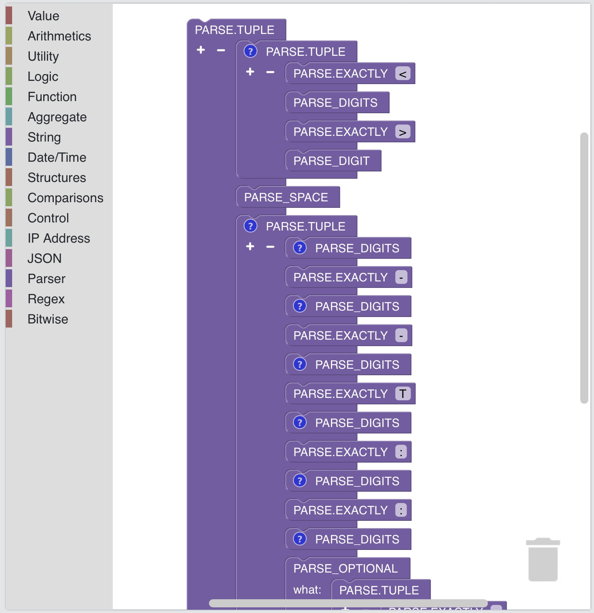

# Vizuální programování v SP-Lang

SP-Lang umožňuje uživatelům vytvářet výrazy manipulací s prvky výrazu graficky, místo aby je specifikovali textově.

!!! warning ":construction: Ve výstavbě :construction:"
    Vizuální programování v SP-Lang je ve výstavbě.

_Příklad parseru Syslog implementovaného ve vizuálním SP-Lang:_

