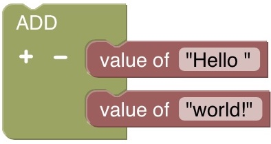

# SP-Lang Documentation

Welcome to the documentation for SP-Lang. SP-Lang stands for _Stream Processing Language_.
SP-Lang is designed to be intuitive and easy to use language, even for people who don't have experience with programming.
We strive to make it as simple to use as spreadsheet macros or SQL, allowing you to perform powerful data processing tasks with minimal effort.

The key goal of SP-Lang is that it does a lot of the heavy lifting for you, so you can focus on what you want to accomplish rather than worrying about the details of how to implement it.
This low-code approach means that you can get up and running quickly, without having to learn a lot of complex programming concepts.

We hope that this documentation will provide you with all the information you need to get started with our language and start taking advantage of its powerful stream processing capabilities. Thank you for choosing our language, and we look forward to seeing what you can accomplish with it!

!!! quote "Made with :octicons-heart-fill-24:{ .heart } by TeskaLabs"

    SP-Lang is the technology built at [TeskaLabs](https://www.teskalabs.com).  

<!--  -->


## Introduction

_SP-Lang_ is a [functional language](https://en.wikipedia.org/wiki/Functional_programming) that uses the [YAML](https://en.wikipedia.org/wiki/YAML) syntax.

SP-Lang delivers very high performance because it is compiled to [the machine code](https://en.wikipedia.org/wiki/Machine_code).
This, together with extensive optimizations, gives the performance in the same category as C, Go or Rust; respective the highest possible performance.

For that reason, SP-Lang is a natural candidate for a cost-effective processing of the massive data streams in the cloud or on‑premise applications.


!!! example "Hello world! in SP-Lang"

    ```yaml
    !ADD
    - Hello
    - " "
    - world
    - "!"
    ```


!!! example "The same example in the visual form of SP-Lang"

    


**Your first steps with SP-Lang start in the [tutorial](tutorial).**

## Features of the SP-Lang

* [📜 Declarative language](https://en.wikipedia.org/wiki/Declarative_programming)
* [🔗 Functional language](https://en.wikipedia.org/wiki/Functional_programming)
* [🔐 Strongly typed](https://en.wikipedia.org/wiki/Strong_and_weak_typing)
* [💡 Type inference](https://cs.wikipedia.org/wiki/Typová_inference)
* 🐍 Interpreted in Python
* 🚀 Compiled by [LLVM](https://llvm.org/)
* Syntax is based on [YAML](https://en.wikipedia.org/wiki/YAML)
