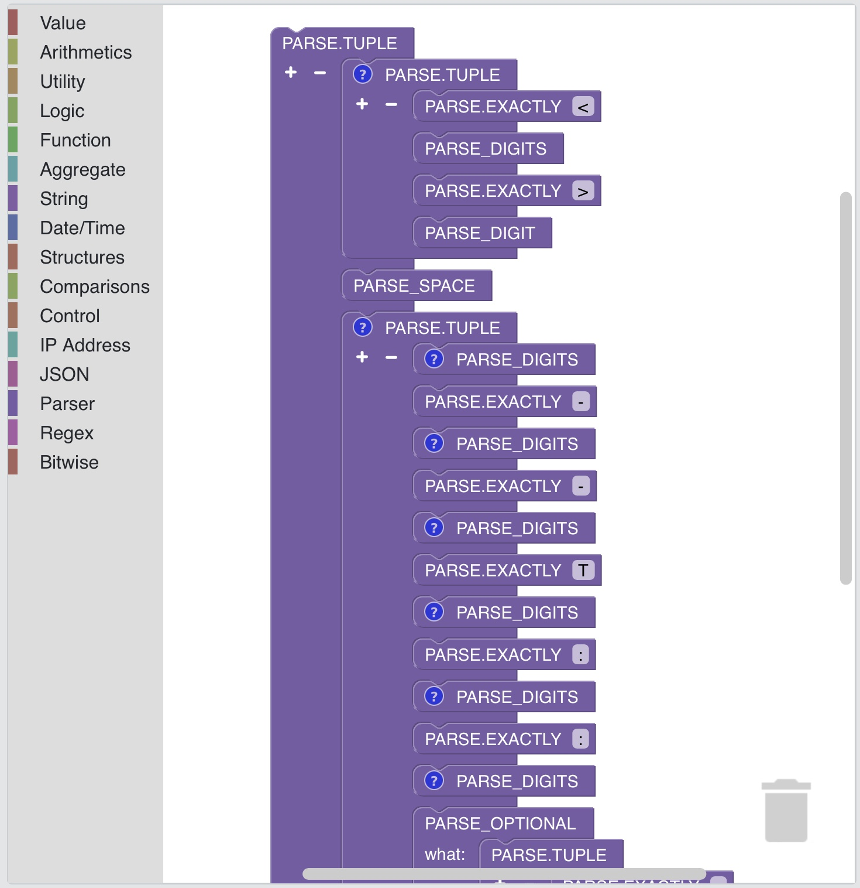

# Visual programming in SP-Lang

SP-Lang lets users create expressions by manipulating expression elements graphically rather than by specifying them textually.

!!! warning ":construction: Under Construction :construction:"
    Visual programming in SP-Lang is under construction.

_Example of the Syslog parser implemented in the visual SP-Lang:_

