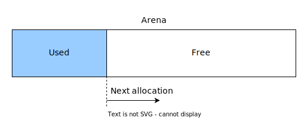

# Memory Management

Memory management in SP-Lang is based on [memory arenas](https://en.wikipedia.org/wiki/Region-based_memory_management) concept.

_Diagram: Memory arena layout_

Memory arena is a pre-allocated bigger memory chunk that is available for a given lifecycle (aka. one event processing cycle).
When any code related to the event processing needs a memory, it asks for a slice from a memory arena.
This slice is swiftly provided because it is always taken from a beginning of the free space within the arena (aka offset).
The deallocation happens at once, for whole arena; it is called the "reset" of the memory arena.
This means that the memory arena concept is very efficient, doesn't introduce memory fragmentation and couple nicely with a static single assignment concept of the SP-Lang.

Memory arena also supports a list of destructors that allows an integration with traditional e.g. `malloc` allocations for 3rd party technologies that are not compatible with memory arena (e.g. PCRE2 library).
Destructors are executed during the arena reset.

Memory arena could be extended by another memory chunk is the current chunk is depleted.
