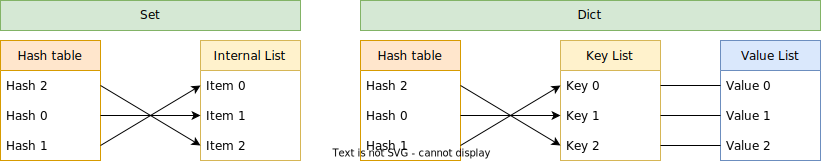

# Set and Dictionary details

Set and Dictionary types are implemented using a [hash table](https://en.wikipedia.org/wiki/Hash_table).
The used hashing function is [XXHASH64](https://cyan4973.github.io/xxHash/).

## Hash table

Hash table is designed so that it maps the 64bit hash of the key directly into an index of the item.
The [perfect hash](https://en.wikipedia.org/wiki/Perfect_hash_function) strategy is applied to prevent hash collisions.
If a hash table building algorythm detects a colision, it is restarted with a different seed value.
This approach leverages relatively rate xxhash64 collision rate.

A hash table can be (lazily) generated only when it is needed (e.g. for IN and GET expressions).
This applies for objects created dynamically during runtime.
Static sets a dictionaries provide a prepared hash table.

A hash table is searched using a [binary search](https://en.wikipedia.org/wiki/Binary_search_algorithm).
